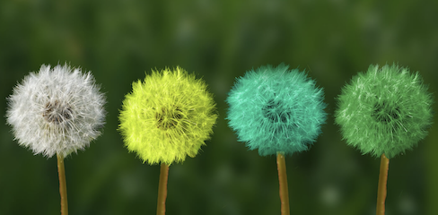

+++
title = "Die erste Reportage"
date = "2022-07-01"
draft = false
pinned = false
tags = ["Liebe", "Kampf", "Hass", "Krieg"]
image = "bildschirmfoto-2022-07-01-um-20.27.42.png"
description = "Hier kommt der Lead hin... "
footnotes = "HIer sind meine Quellen"
+++
Hier beginnt ganz normal der Text

## Zwischentitel

Das ist die Fortsetzung des Textes

### Zweiter Zwischentitel 

Text Text Text 

> Und jetzt kommt ein Zitatausriss

Und jetzt noch ein kleines Filmchen<https://www.youtube.com/watch?v=MnNZNfixTOw>